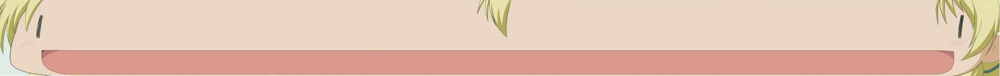

# Miyako



This program allows you to convert the graphics from the game [Hidamari Sketch Dokodemo Sugoroku × 365](https://datomatic.no-intro.org/index.php?page=show_record&s=28&n=3378) on Nintendo DS, to and from PNG.

It will only handle formats used by the game. For a more generic editor, try [https://github.com/Garhoogin/NitroPaint](NitroPaint) (which is the source of the formats' documentation).

*This program is currently being written, it's pretty limited*

## Usage

Convert a file into a .png image.

```bash
$ miyako -d --nclr <file>.NCLR --ncgr `<file>.NCGR#` --nscr <file>.NSCR output.png
```
*Some files are LZ11-encoded and have a number sign at the end of their filename*
